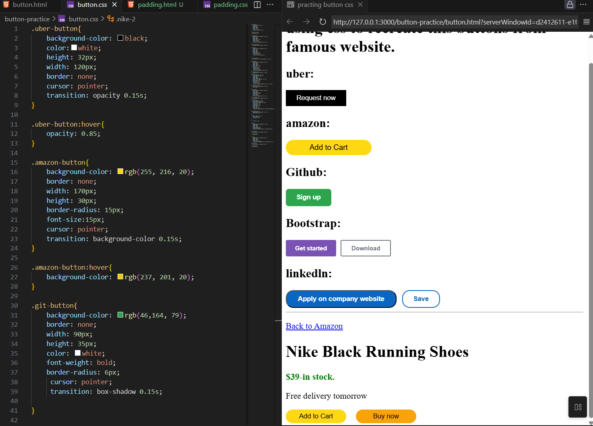
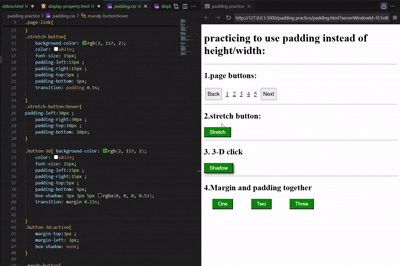
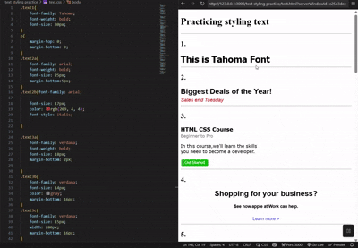
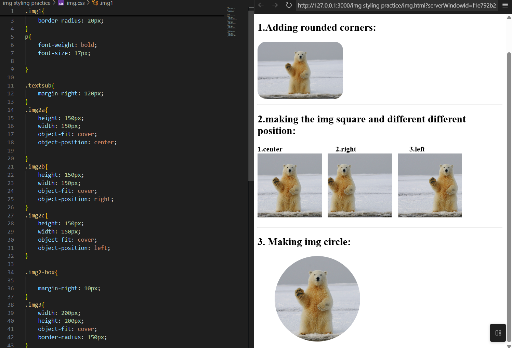
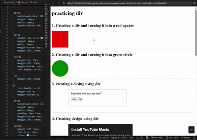
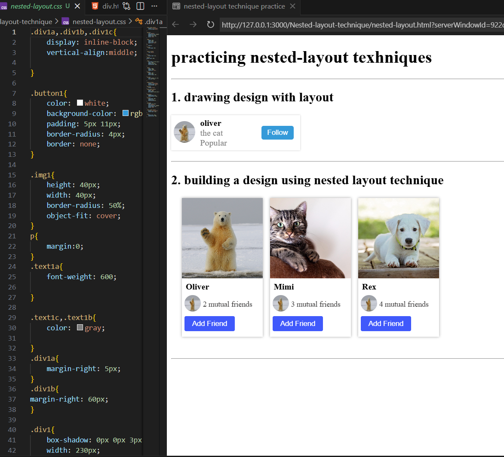
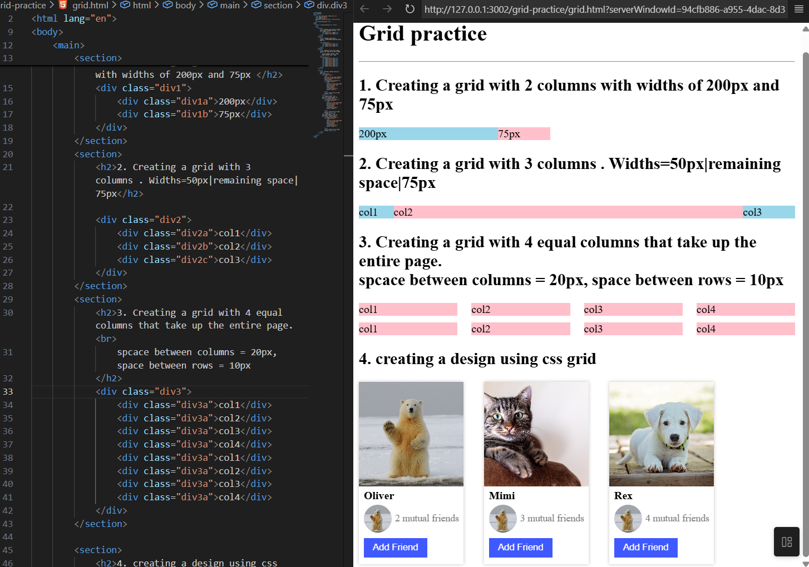
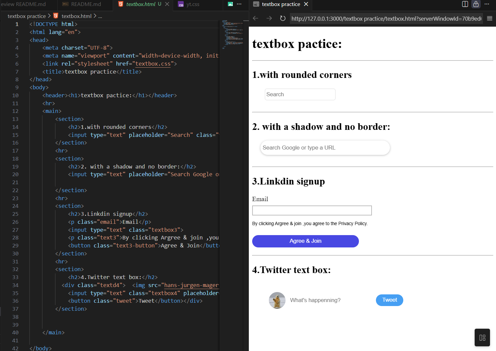
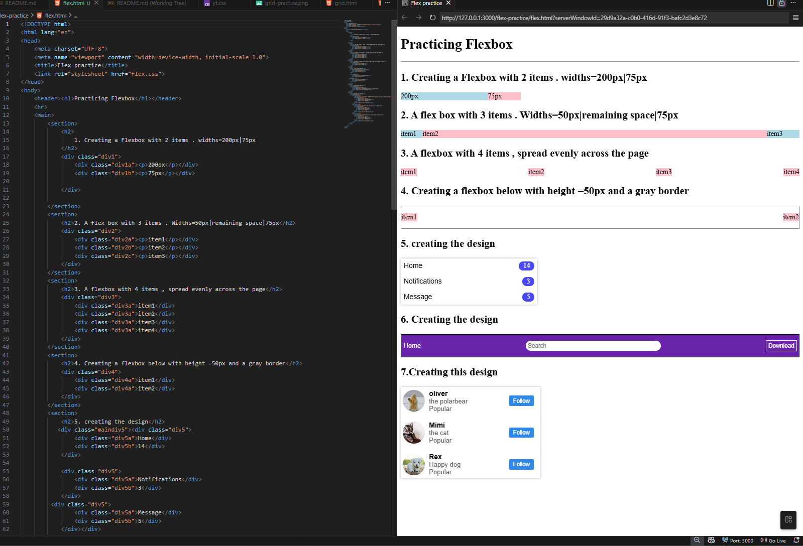

# CSS Practice 🧑‍💻

This repository contains my personal CSS practice modules.  
Each folder focuses on a specific concept or component, helping me build confidence and fluency with HTML and CSS.

## 📁 Current Folders
- `button-practice`/  
  A simple collection of plain buttons created using HTML and CSS — just foundational button markup and basic styling.

- `padding-practice`/  
  A collection of buttons styled using padding instead of the height and width properties I used before. Also includes basic transitions.

- `text-styling-practice`/  
  A set of exercises focused on styling text elements.

- `img-styling-practice`/  
  Practicing image styling using `object-fit: cover` and `object-position` (left, right, center). Just the basics for now.

- `display-property-css`/  
  Learning how to use the CSS display property — especially inline and block — to control layout and styling. Includes examples that show how display types affect element behavior and spacing.

- `div-practice`/  
  Practicing different ways to style and structure `
` elements. Includes:
  - Colored squares and circles using `border-radius`
  - Card-style containers with text and buttons
  - Image styling with `object-fit` and rounded corners
  - Input boxes and search bars with shadows
  - Multiple div layouts using `inline-block` and centered alignment

- `google-font-practice`/  
  Learned how to add and use **Google Fonts** in CSS. Practiced importing fonts via `<link>` in HTML and applying them to text elements with different weights and styles.

- `nested-layout-technique`/  
  Practicing the concept of **nested layouts** in CSS.  
  - Understanding how one layout can live inside another  
  - Using simple containers to structure sections

- `grid-practice`/
  Practicing how to use grid in css
  - Understanding grid properties
  - creating an incomplete clone of youtube just for practice of using grid

- `textbox-practice`/
   Practicing how to style textbox
  - styling many text box of different different type as practice

- `flex-practice`/
   Practicing how to use flex in css
   - Understanding flex properties and in which case they are used
   - practicing how to use flex by creating things using flex

## 🛠️ What's Next
As I continue learning, I’ll add more folders like:
- `font-practice`/ – working with font families, alignment, and text decoration  
- `layout-practice`/ – exploring basic layout techniques and positioning  

## 🎯 Goals
- Strengthen core CSS skills through focused, modular practice  
- Keep each module clean, beginner-friendly, and well-organized  
- Document progress clearly for future reference and sharing  

Feel free to explore or fork this repo.  
It’s part of my journey to master CSS one concept at a time.

## 📷 SCREENSHOTS 
### `button-practice`
  

### `padding-practice`
  

### `text-styling-practice`
  
### `img-styling-practice`
  
### `display-property-css`
  
### `div-practice`
  
### `google-font-practice`
  

### `nested-layout-technique`  
  

### `grid-practice`
   

### `yt using grid`
   

### `textbox-practice`
  

### `flex-practice`
    